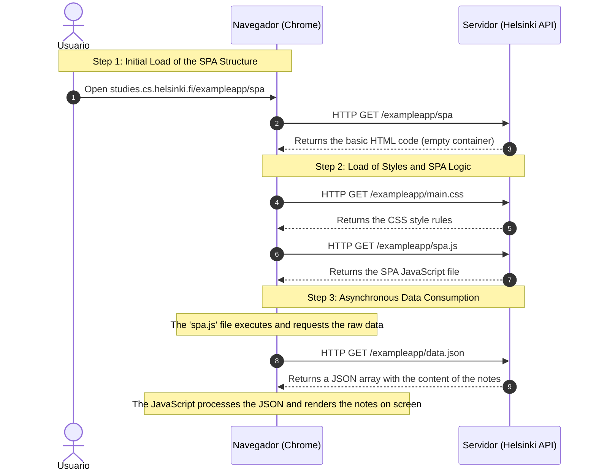

```mermaid
sequenceDiagram
    autonumber
    actor Usuario
    participant Navegador as Navegador (Chrome)
    participant Servidor as Servidor (Helsinki API)

    Note over Usuario,Navegador: Step 1: Initial Load of the SPA Structure
    Usuario->>Navegador: Open studies.cs.helsinki.fi/exampleapp/spa
    Navegador->>Servidor: HTTP GET /exampleapp/spa
    Servidor-->>Navegador: Returns the basic HTML code (empty container)
    
    Note over Navegador,Servidor: Step 2: Load of Styles and SPA Logic
    Navegador->>Servidor: HTTP GET /exampleapp/main.css
    Servidor-->>Navegador: Returns the CSS style rules
    Navegador->>Servidor: HTTP GET /exampleapp/spa.js
    Servidor-->>Navegador: Returns the SPA JavaScript file

    Note over Navegador,Servidor: Step 3: Asynchronous Data Consumption
    Note over Navegador: The 'spa.js' file executes and requests the raw data
    Navegador->>Servidor: HTTP GET /exampleapp/data.json
    Servidor-->>Navegador: Returns a JSON array with the content of the notes
    Note over Navegador: The JavaScript processes the JSON and renders the notes on screen
```
